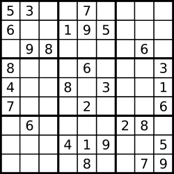

https://leetcode.com/problems/valid-sudoku/?envType=study-plan-v2&envId=top-interview-150

36. Valid Sudoku
Medium
9K
938
Companies
Determine if a 9 x 9 Sudoku board is valid. Only the filled cells need to be validated according to the following rules:

Each row must contain the digits 1-9 without repetition.
Each column must contain the digits 1-9 without repetition.
Each of the nine 3 x 3 sub-boxes of the grid must contain the digits 1-9 without repetition.
Note:

A Sudoku board (partially filled) could be valid but is not necessarily solvable.
Only the filled cells need to be validated according to the mentioned rules.
 

Example 1:


Input: board = 
[["5","3",".",".","7",".",".",".","."]
,["6",".",".","1","9","5",".",".","."]
,[".","9","8",".",".",".",".","6","."]
,["8",".",".",".","6",".",".",".","3"]
,["4",".",".","8",".","3",".",".","1"]
,["7",".",".",".","2",".",".",".","6"]
,[".","6",".",".",".",".","2","8","."]
,[".",".",".","4","1","9",".",".","5"]
,[".",".",".",".","8",".",".","7","9"]]
Output: true
Example 2:

Input: board = 
[["8","3",".",".","7",".",".",".","."]
,["6",".",".","1","9","5",".",".","."]
,[".","9","8",".",".",".",".","6","."]
,["8",".",".",".","6",".",".",".","3"]
,["4",".",".","8",".","3",".",".","1"]
,["7",".",".",".","2",".",".",".","6"]
,[".","6",".",".",".",".","2","8","."]
,[".",".",".","4","1","9",".",".","5"]
,[".",".",".",".","8",".",".","7","9"]]
Output: false
Explanation: Same as Example 1, except with the 5 in the top left corner being modified to 8. Since there are two 8's in the top left 3x3 sub-box, it is invalid.
 

Constraints:

board.length == 9
board[i].length == 9
board[i][j] is a digit 1-9 or '.'.

```python
class Solution(object):
    def isValidSudoku(self, board):
        """
        :type board: List[List[str]]
        :rtype: bool
        """
```
The problem you provided is the "Valid Sudoku" problem on LeetCode. The task is to determine if a given 9x9 Sudoku board is valid according to the Sudoku rules.

To solve this problem, you can check the validity of each row, column, and 3x3 sub-box separately. Here's the implementation of the `isValidSudoku` function in Python:

```python
class Solution(object):
    def isValidSudoku(self, board):
        """
        :type board: List[List[str]]
        :rtype: bool
        """
        # Check rows
        for row in board:
            if not self.isUnique(row):
                return False
        
        # Check columns
        for col in range(9):
            column = [board[i][col] for i in range(9)]
            if not self.isUnique(column):
                return False
        
        # Check sub-boxes
        for i in range(0, 9, 3):
            for j in range(0, 9, 3):
                sub_box = [board[row][col] for row in range(i, i+3) for col in range(j, j+3)]
                if not self.isUnique(sub_box):
                    return False
        
        return True
    
    def isUnique(self, chars):
        seen = set()
        for char in chars:
            if char != ".":
                if char in seen:
                    return False
                seen.add(char)
        return True
```

The `isValidSudoku` function first checks the validity of each row by iterating through the board and calling the `isUnique` function on each row. The `isUnique` function checks if all the characters in the input list are unique, ignoring the "." characters.

Next, the function checks the validity of each column by constructing a list of each column's elements and calling the `isUnique` function on that list.

Finally, the function checks the validity of each 3x3 sub-box by iterating through the board in increments of 3 for both the row and column indices. It constructs a list of elements in each sub-box and calls the `isUnique` function on that list.

If any of the checks fail, indicating that a digit is repeated in a row, column, or sub-box, the function returns `False`. If all checks pass, the function returns `True`, indicating that the Sudoku board is valid.

The time complexity of this solution is O(1) because the size of the Sudoku board is fixed at 9x9.